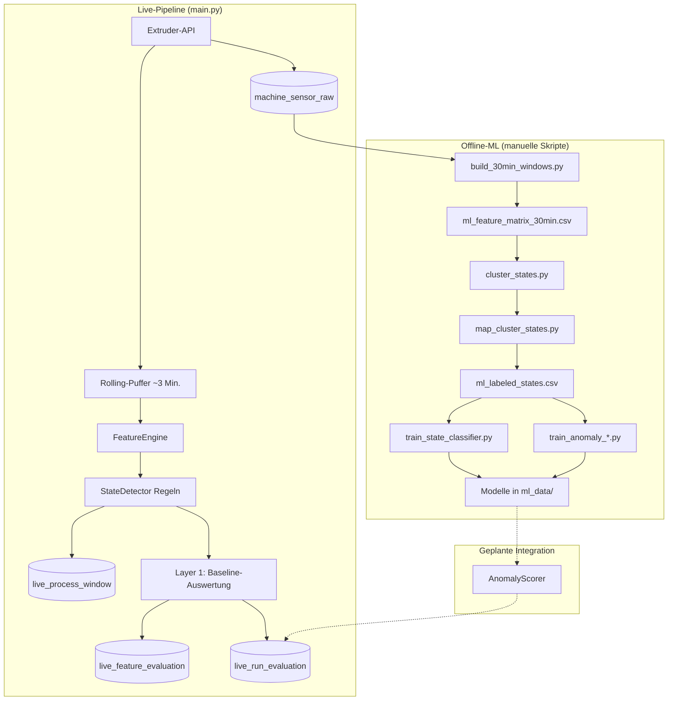
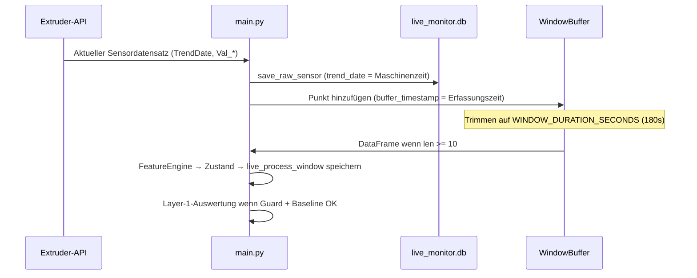
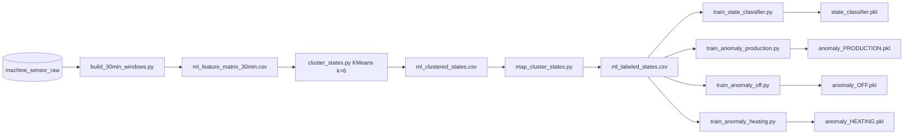
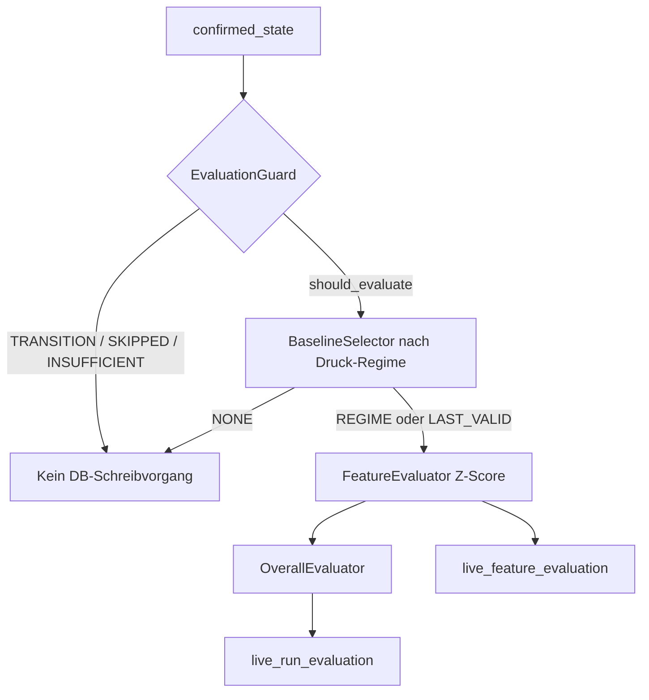
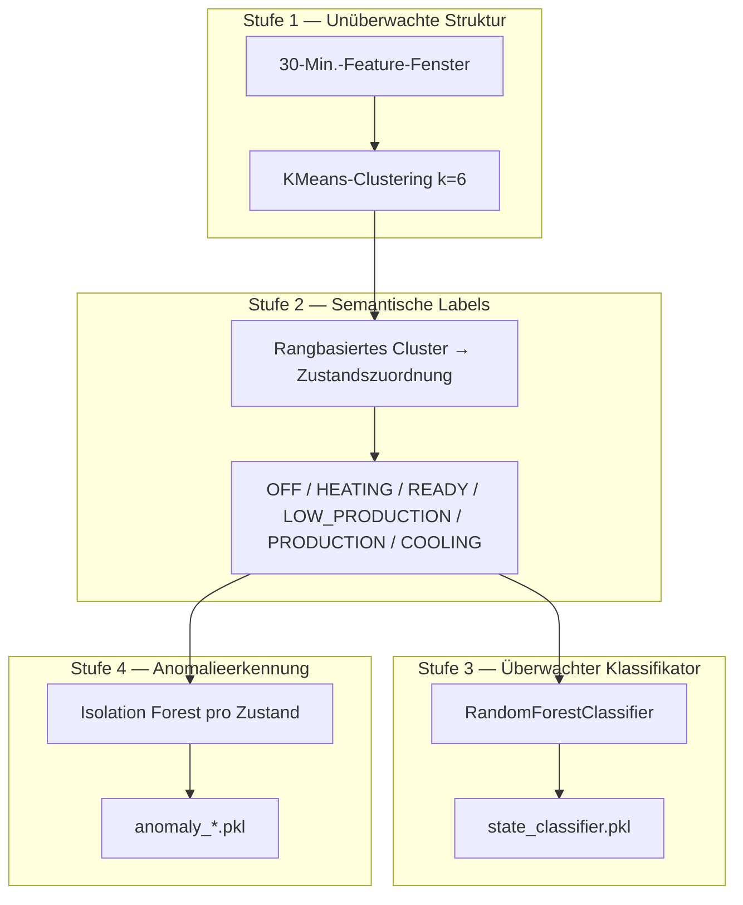
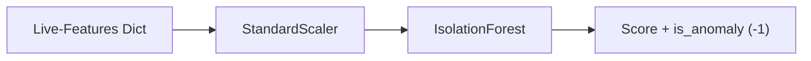
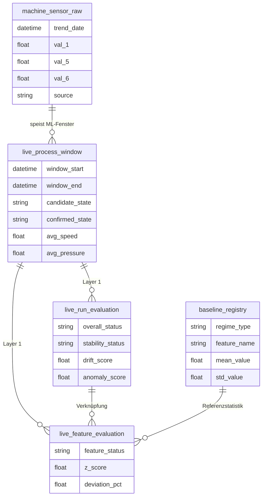
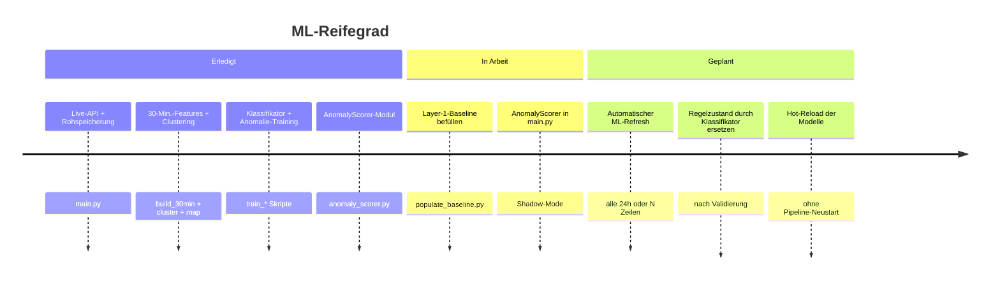

# KI- & ML-Pipeline — Extruder Live-Monitoring

Dieses Dokument beschreibt, wie **künstliche Intelligenz (KI)** und **maschinelles Lernen (ML)** im PM-Project Live-Extruder-Monitoring eingesetzt werden: Datenfluss, Modelle, Training und das Zusammenspiel von Layer 1 (Regeln/Baseline) mit Layer 2 (gelerntes Verhalten).

---

## 1. Architektur auf einen Blick

Das System hat zwei Auswertungsebenen:

| Layer | Name | Ansatz | Fenster | Status |
|-------|------|--------|---------|--------|
| **Layer 1** | Regeln + Baseline | Z-Score vs. `baseline_registry`, fest codierte Zustandsregeln | ~3 Min. (rollierend) | Live in `main.py` (Baseline muss befüllt sein) |
| **Layer 2** | ML-gelernt | Clustering → Labels → Klassifikator + Isolation Forest | 30 Min. | Offline-Training; `AnomalyScorer` bereit für Live-Anbindung |



---

## 2. End-to-end-Datenfluss

### 2.1 Live-Erfassung (alle ~10 s)



**Zeitstempel-Konzept**

- `timestamp` / `trend_date`: Maschinenzeit aus der API (`TrendDate`) — für ML-30-Min.-Buckets und Rohspeicherung.
- `buffer_timestamp`: lokale Erfassungszeit — für stabiles 3-Min.-Rolling-Window, wenn API-Zeit verzögert oder unsortiert ist.

### 2.2 Offline-ML-Aktualisierung (derzeit manuell)



Aus dem Projektroot ausführen:

```powershell
python live_monitor/storage/build_30min_windows.py
python live_monitor/ml/cluster_states.py
python live_monitor/ml/map_cluster_states.py
python live_monitor/ml/train_state_classifier.py
python live_monitor/ml/train_anomaly_production.py
python live_monitor/ml/train_anomaly_off.py
python live_monitor/ml/train_anomaly_heating.py
```

---

## 3. Layer 1 — Regel- & Baseline-Auswertung

### 3.1 Zweck

Aktuelle **3-Minuten**-Fenster-Features mit historischen Statistiken in **`baseline_registry`** vergleichen (pro Regime: LOW / MID / HIGH).

### 3.2 Ablauf



### 3.3 `overall_status` in `live_run_evaluation`

Zusammengefasst aus dem Status je Feature:

| Wert | Bedeutung |
|------|-----------|
| `NORMAL` | Alle ausgewerteten Features innerhalb des normalen Z-Bands |
| `WARNING` | Mindestens ein Feature WARNING (Kern-Features haben Priorität) |
| `CRITICAL` | Mindestens ein Kern-Feature oder beliebiges Feature CRITICAL |

Kern-Features: `pressure_mean`, `screw_speed_mean`, `temperature_mean`, `pressure_per_rpm`.

Z-Score-Bänder (in `feature_evaluator.py`): `|z| < 1.5` → NORMAL; `1.5–2.5` → WARNING; `≥ 2.5` → CRITICAL.

**Voraussetzung:** `baseline_registry` muss befüllt sein (`storage/populate_baseline.py`).

---

## 4. Layer 2 — ML-gelernte Auswertung

### 4.1 Pipeline-Stufen



### 4.2 30-Minuten-Fenster-Features

Erzeugt in `storage/build_30min_windows.py` aus `machine_sensor_raw`, gruppiert nach `TrendDate`:

| Feature-Gruppe | Beispiele |
|----------------|-----------|
| Niveau-Statistiken | `mean_Val_1`, `std_Val_6`, `min_*`, `max_*`, `range_*` |
| Abgeleitete Kennzahlen | `pressure_per_rpm`, `load_per_pressure` |
| Trends (Steigungen) | `slope_Val_1`, `slope_Val_6`, `slope_temperature` |
| Qualität | `row_count`, `valid_fraction`, `regime`, `is_stable` |

**Steigungsberechnung:** Pro 30-Min.-Bucket wird eine Gerade `Wert ~ Zeit_sekunden` mit `numpy.polyfit(..., 1)` angepasst; der Koeffizient ist die Steigung (Änderung pro Sekunde). Weniger als 2 Punkte → Steigung `0`.

### 4.3 Clustering → Zustandslabels

- **Eingabe:** `ml_feature_matrix_30min.csv`
- **Algorithmus:** KMeans mit `k=6` (Elbow-Plot als `elbow_plot.png`)
- **Zuordnung:** `map_cluster_states.py` weist Cluster-IDs per Rangregeln (Drehzahl, Druck, Temperatursteigung usw.) Betriebszuständen zu.
- **Ausgabe:** `ml_labeled_states.csv` mit `cluster_id` und `predicted_state`

### 4.4 Zustandsklassifikator

| Punkt | Detail |
|-------|--------|
| Skript | `ml/train_state_classifier.py` |
| Modell | Random Forest (`class_weight=balanced`) |
| Split | **80/20 chronologisch** nach `window_start` (vermeidet Leakage durch überlappende Fenster) |
| Artefakte | `state_classifier.pkl`, `state_classifier_scaler.pkl` |

### 4.5 Anomalieerkennung (Isolation Forest)

Ein Modell pro Maschinenzustand, sofern genügend gelabelte Daten vorhanden sind:

| Zustand | Trainingsskript | Artefakte | Registry-Status |
|---------|-------------------|-----------|-----------------|
| PRODUCTION | `train_anomaly_production.py` | `anomaly_PRODUCTION.pkl` + Scaler | ready |
| OFF | `train_anomaly_off.py` | `anomaly_OFF.pkl` + Scaler | ready |
| HEATING | `train_anomaly_heating.py` | `anomaly_HEATING.pkl` + Scaler (Feature-Teilmenge) | ready |
| LOW_PRODUCTION, COOLING, READY | — | — | insufficient_data |

Training nutzt **stabile** Fenster des jeweiligen Zustands (z. B. PRODUCTION + `is_stable=True`). Bei Inferenz liefert `AnomalyScorer` (`ml/anomaly_scorer.py`):

- Lädt Modelle über `ml/model_registry.py`
- Bewertet Live-Feature-Dict für `confirmed_state`
- Gibt zurück: `ml_anomaly_score`, `ml_is_anomaly`, `ml_model_status`



---

## 5. Datenbanktabellen (KI/ML-relevant)



---

## 6. Projektstruktur (ML-Module)

```text
live_monitor/
  main.py                      # Live-Schleife + Layer 1
  config.py                    # API, Fenster, ML-Pfade, Schwellenwerte
  ingestion/api_client.py      # Abfrage + Normalisierung Sensoren
  processing/
    window_buffer.py           # 3-Min.-Rolling-Puffer
    feature_engine.py          # Live-Fenster-Features
  state/state_detector.py      # Regelbasierte Zustände (+ ANOMALY-Grenzen)
  evaluation/                  # Layer 1
    evaluation_guard.py
    baseline_selector.py
    feature_evaluator.py
    overall_evaluator.py
  storage/
    build_30min_windows.py     # ML-Feature-Matrix
    populate_baseline.py       # Layer-1-Baselines
    db_writer.py               # SQLAlchemy-Modelle
  ml/
    cluster_states.py          # KMeans
    map_cluster_states.py      # Cluster → Zustandsname
    train_state_classifier.py
    train_anomaly_production.py
    train_anomaly_off.py
    train_anomaly_heating.py
    anomaly_scorer.py          # Live-Inferenz-Helfer
    model_registry.py          # Modellpfade + Bereitschaft
  ml_data/                     # CSVs + .pkl-Artefakte
  api/routes.py                # REST für Live + Baseline
```

---

## 7. Roadmap: Ist vs. Ziel



**Empfohlene Reihenfolge (vereinbart)**

1. Layer-2-Modelle manuell validieren (Metriken, Confusion Matrix, Cluster stichprobenartig prüfen).
2. Layer 2 im **Shadow-Mode** parallel zu Layer 1 betreiben (beides loggen, Alerts noch nicht umstellen).
3. Layer-1-Baseline-Pfad nur als Fallback stabilisieren.
4. Layer 2 zur primären Auswertung machen; automatisches Retraining zuletzt.

---

## 8. Wichtige Konfiguration (`config.py`)

| Einstellung | Standard | Rolle |
|-------------|----------|-------|
| `POLL_INTERVAL_SECONDS` | 10 | Live-Abfrageintervall |
| `WINDOW_DURATION_SECONDS` | 180 | Layer-1-Rolling-Fenster |
| `ML_WINDOW_MINUTES` | 30 | ML-Aggregations-Bucket |
| `ML_WINDOW_MIN_ROWS` | 10 | Min. Punkte pro 30-Min.-Fenster |
| `CONFIRMATION_WINDOWS` | 3 | Zustandsbestätigung |
| `ML_OUTPUT_DIR` | `live_monitor/ml_data` | Artefakte + CSVs |
| `DB_CONNECTION_STRING` | `sqlite:///live_monitor.db` | Datenbank |

---

## 9. Artefakte in `ml_data/`

| Datei | Beschreibung |
|-------|--------------|
| `ml_feature_matrix_30min.csv` | 30-Min.-Fenster für ML |
| `ml_clustered_states.csv` | + `cluster_id` |
| `ml_labeled_states.csv` | + `predicted_state` (Trainingslabels) |
| `state_classifier.pkl` / `state_classifier_scaler.pkl` | Zustandsklassifikator |
| `anomaly_PRODUCTION.pkl` / `*_scaler.pkl` | Anomalie-Modell Produktion |
| `anomaly_OFF.pkl` / `anomaly_HEATING.pkl` | zustandsspezifische Anomalie |
| `elbow_plot.png` | KMeans-Elbow-Diagnose |

Optional (Legacy): `ml_feature_matrix.csv` (4-Min.-kombinierter Datensatz) — wird vom 30-Min.-Clustering-Pfad nicht verwendet.

---

## 10. Glossar

| Begriff | Bedeutung |
|---------|-----------|
| **TrendDate** | Maschinenzeitstempel aus der API; steuert ML-30-Min.-Gruppierung |
| **Regime** | Druckband: LOW (&lt;280), MID (280–320), HIGH (&gt;320 bar) |
| **Stabiles Fenster** | Geringe Variabilität bei Drehzahl/Druck-Kennzahlen (`is_stable`-Flag) |
| **Z-Score** | Layer-1-Abweichung vom Baseline-Mittelwert in Standardabweichungen |
| **Isolation Forest** | Unüberwachte Anomalieerkennung; `-1` = Anomalie |
| **Shadow-Mode** | ML-Vorhersagen ausführen, ohne Produktions-Alerts zu ändern |

---

## 11. Verwandte Dokumentation

- Betriebs-Runbook: `live_monitor/README.md`
- Historische Segmentierung (Stage 2): `timeSeriesDB/.../process_segmentation_outputs/README.md`

---

*Zuletzt aktualisiert: Projektstand mit Layer 1 in `main.py`, Layer-2-Trainingsartefakten in `ml_data/` und `AnomalyScorer` zur Live-Integration vorbereitet.*
